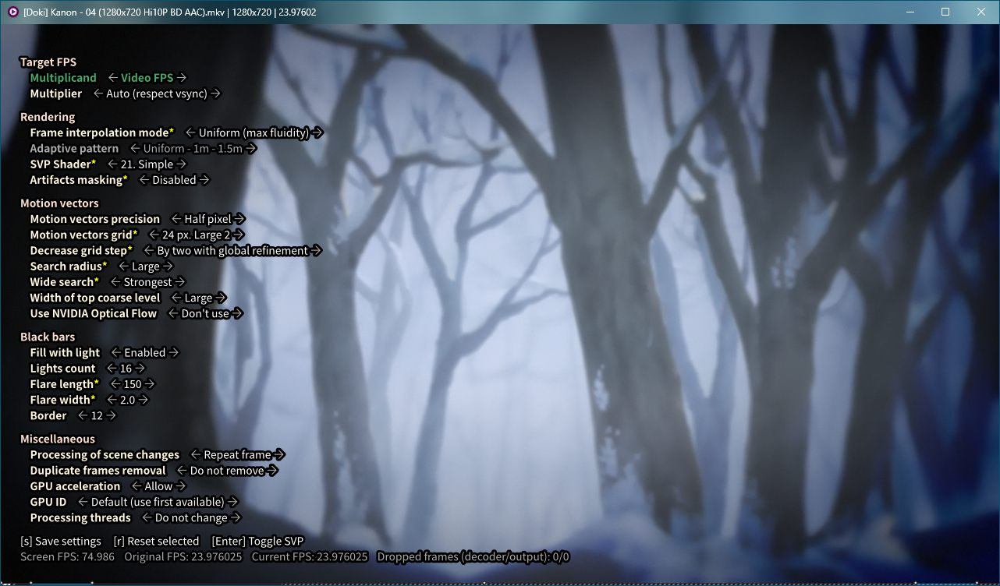

# svp4mpv

An mpv script for Windows that provides [SVP](https://www.svp-team.com/)
frame interpolation without having to use the official GUI.
Comes with a menu for direct control:

SVP converts any video to 60+ FPS in real time as you watch it, with GPU
acceleration supported. It can also fill black bars with lights when
the monitor's aspect ratio and the video's differ.

This script makes use of the last SVPFlow DLL versions that could
be extracted from the demo and used without requiring the GUI to be running.
The license found in this repository does not apply to any included DLL files.

Not implemented:
- Basic performance-quality slider (from looking at the original GUI's
  generated scripts, most levels changed absolutely nothing)
- RIFE AI interpolation (too slow and too complicated for not much gained)
- Automatic cropping of baked-in black bars
  (try [dynamic-crop.lua](https://github.com/Ashyni/mpv-scripts))
- Phoning home

## Installation

Git clone or click **Code** → **Download ZIP** and then extract into your mpv
scripts folder (usually `%APPDATA%\mpv\scripts` or `~/.config/mpv/scripts`).

Your mpv build must support VapourSynth.
If you're using [mpv.net](https://github.com/mpvnet-player/mpv.net), this
should be the case.

Add the following to your mpv.conf to prevent desyncs when seeking:

    hr-seek-framedrop=no

Hardware-accelerated video playback requires using a `-copy` decoder, e.g.

    hwdec=d3d11va-copy

## Usage

Press Alt+Shift+S to open the menu, navigate with the arrow keys.
While the menu is open, press Enter to toggle SVP on or off.

More details about the options can be found on the
[SVP wiki](https://www.svp-team.com/wiki/Manual:FRC#Manual_Options_Selection).
If you're in a hurry, try the settings from the above screenshot for maximum
smoothness (the `*` indicates non-default settings).

Changes are saved in mpv's script-opts folder when you press S while the menu
is open. Manual editing is not advised.

The default multiplicand/multiplier settings pair try to be smart,
for example: if you play a 24 FPS video on a 75hz screen, the script will
multiply the framerate by exactly 3x to reach 72 FPS, as integer multipliers
tend to give better results and 72 is right under 75.

However, if the screen is 60hz instead, then the multiplier will be 2.5 to
reach exactly 60 FPS, since forcing 72 would cause stutter from dropped frames
and the smoothness gained from 60 FPS in my opinion outweighs the benefits of
using a 2x integer multiplier and getting only 48 FPS.

Most 60hz monitors can be easily overclocked to at least 72hz,
which will make a noticeable difference for SVP.

If you have multiple monitors with different framerates, you may need to
use mpv in full screen to avoid dropped frames.

## Known issues

- Kaspersky "System Watcher": this feature has been known
  to make CPU usage shoot up while playing videos with SVP in full screen,
  causing lots of dropped frames. Disabling it solved the issue.
  This may have been fixed in more recent versions.
